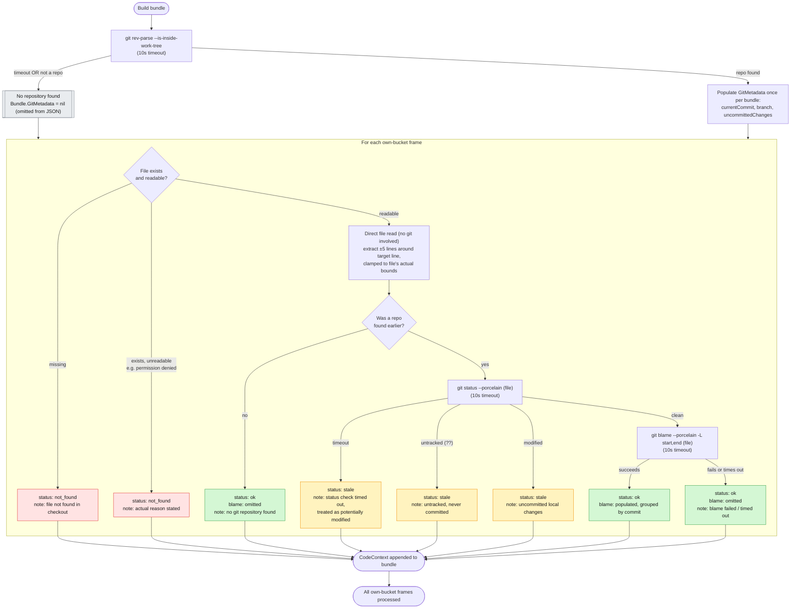

# Flow: own-code context extraction

Companion to `spec.md`/`plan.md`. This traces exactly how one own-bucket
frame becomes a `contract.CodeContext`, and how `Bundle.GitMetadata` gets
built, across every branch spec.md defines.

**The one thing to internalize before reading the diagram:** the actual
source code lines (the `snippet.code` text) are **always** read directly
from disk via a plain windowed file read — never through git, in either
scenario. Git is used for exactly two things: (1) `Bundle.GitMetadata`
(repo-level commit/branch/uncommitted-changes info), and (2) per-frame
`blame` data (who last touched these lines, in which commit). If git is
unavailable for any reason, the snippet is completely unaffected — only
`blame` and the `status`/`note` explaining its absence change.

## Diagram

## Scenario 1: git repo does not exist (or can't be confirmed)

Triggered by `git rev-parse --is-inside-work-tree` failing, returning
"not a git repository," or timing out at 10s. From this point on, **no
further git commands run at all** for the rest of the bundle build —
there's no `git status`, no `git blame`, nothing. This is deliberate:
once we can't confirm a repo exists, there's nothing meaningful left for
git to tell us, so we don't keep trying.

- **`Bundle.GitMetadata`** — entirely absent from the output JSON (`nil`
  pointer, `omitempty`). Not zero values, not an empty object — genuinely
  not there, so a consumer can't mistake "no repo" for "repo with no
  commits yet."
- **File missing** (own-bucket frame references a path that doesn't
  exist) — `status: "not_found"`, same as it would be with a repo
  present. Git's absence has no bearing on this check; it's a plain
  `os.Stat`.
- **File exists but unreadable** (permission denied, etc.) — also
  `status: "not_found"`, `note` states the real reason. Same reasoning:
  this is a filesystem check, independent of git.
- **File exists and is readable** (the common case) — snippet is
  extracted via direct file read, exactly as it would be in Scenario 2.
  `status: "ok"`, `blame` is omitted (there's no git history to draw it
  from), `note` explains no git repository was found. This is **not** an
  error state — the bundle is still fully usable, just without commit
  attribution.

## Scenario 2: git repo exists

`Bundle.GitMetadata` is populated once, up front, regardless of how many
own-bucket frames follow (or whether there are any at all). Then, **per
frame**, independent of every other frame:

- **File missing / unreadable** — identical to Scenario 1's handling.
  The repo's existence doesn't change this check at all.
- **File tracked, clean** (`git status --porcelain` returns nothing for
  it) — the "happy path." `git blame` runs over just the snippet's line
  range:
  - **Blame succeeds** — `status: "ok"`, `blame` populated with one
    entry per contiguous same-commit range in that window.
  - **Blame fails or times out** (e.g. `git` binary missing from `PATH`,
    corrupted repo, pathological hang) — `status` stays `"ok"` — the file
    itself is still trustworthy, only attribution is missing. `blame`
    omitted, `note` explains the failure. Not fatal to the bundle.
- **File tracked, modified** (uncommitted local changes) — `status:
  "stale"`, `blame` omitted (nothing reliable to blame — the working
  copy has diverged from any committed version), `note` says
  "uncommitted local changes."
- **File untracked** (exists on disk, `git add` never run, no commit
  history at all) — also `status: "stale"`, same git-status check as the
  modified case (both show up as non-empty `git status --porcelain`
  output), but `note` says "untracked, never committed" instead — the
  status value is shared, the reason stated is not.
- **`git status` check itself times out** — treated the same as
  "modified": `status: "stale"`, but `note` says the check couldn't be
  completed in time rather than describing a real diff. This is the one
  deliberately *pessimistic* default in the whole flow — we'd rather
  under-trust a file we couldn't verify than silently present it as
  clean when we don't actually know.

## Why blame and status are the only things that ever change

Every branch above produces a fully-formed `CodeContext` with a real
`snippet.code` — the tool never refuses to show you a frame's source just
because git had a problem. The three status values map to three distinct
levels of trust in the *metadata*, not the code itself:

- **`"ok"`** — snippet is shown; blame is either present (best case) or
  explained as unavailable (no repo / blame failed) — never silently
  missing with no reason given.
- **`"stale"`** — snippet is shown, but flagged: what's on disk may not
  be what actually produced the trace (uncommitted edits, an unverified
  status check, or no committed history at all to compare against).
- **`"not_found"`** — no snippet possible; the frame's file genuinely
  couldn't be read, for a stated reason.
